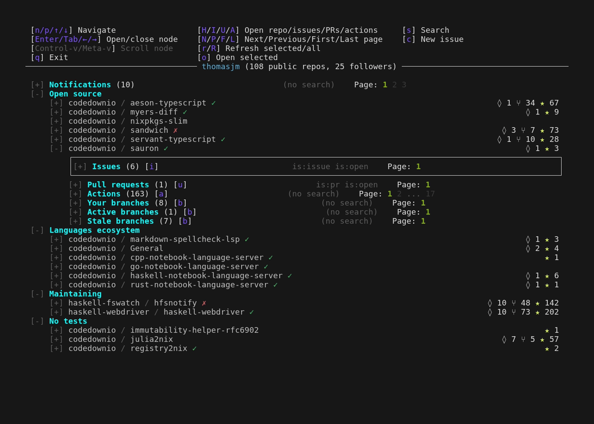
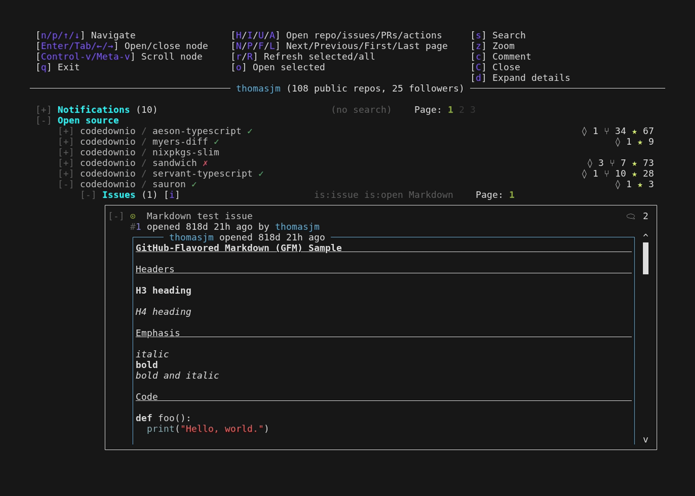
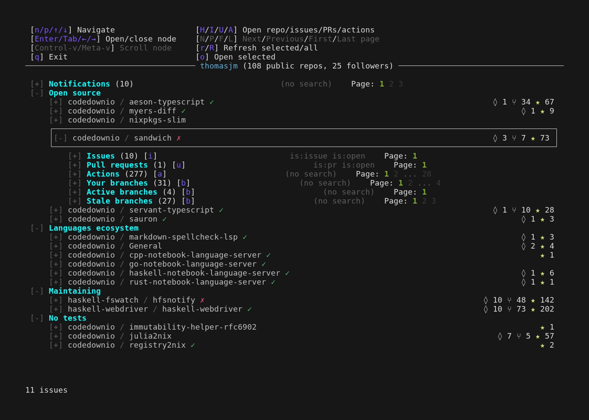
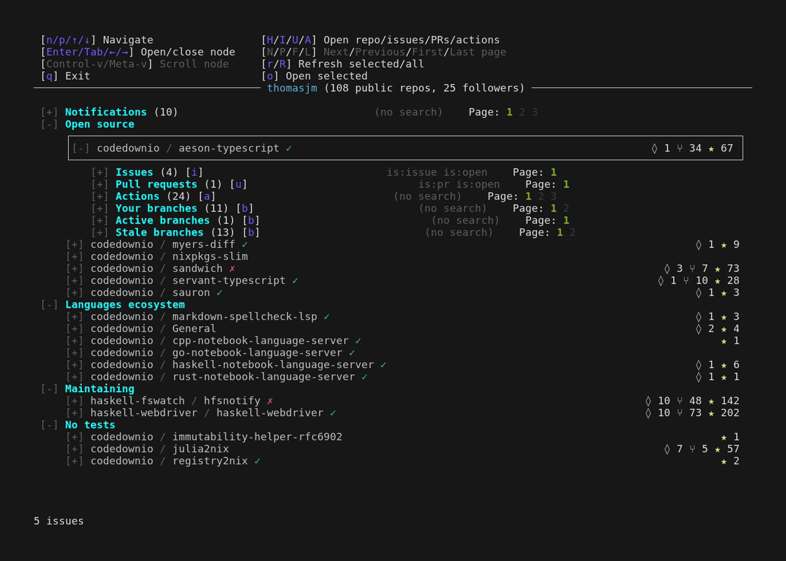
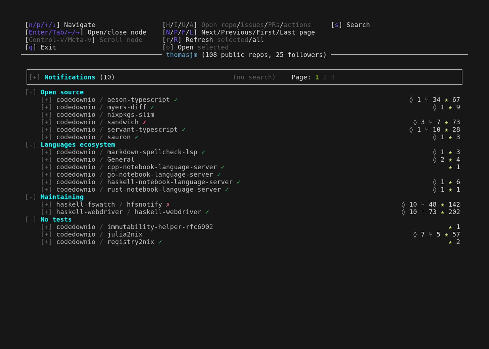

<p align="center">
  
</p>

<h1 align="center">sauron</h1>

<p align="center">
  A terminal UI for your GitHub repositories.
  <br />
  Issues, pull requests, workflow runs, branches, and notifications — all in one place.
</p>

---

## Table of Contents

- [Why Sauron?](#why-sauron)
- [Features](#features)
- [Install](#install)
- [Setup](#setup)
- [Configuration](#configuration-single-repo)
- [CLI Options](#cli-options)
- [License](#license)

## Why Sauron?

Most Git TUIs (`lazygit`, `gitui`) focus on local operations — staging, committing, rebasing. They don't talk to the GitHub API. The `gh` CLI can fetch GitHub data but isn't an interactive dashboard. Sauron fills the gap: a persistent, keyboard-driven TUI that watches **multiple repos at once** and gives you live access to issues, PRs, CI runs, and notifications without leaving the terminal.

| Feature | Sauron | `gh` CLI | `gh-dash` | lazygit | gitui |
|---|:---:|:---:|:---:|:---:|:---:|
| Multi-repo dashboard | :white_check_mark: | :x: | :white_check_mark: | :x: | :x: |
| Browse/search issues and PRs | :white_check_mark: | list only | :white_check_mark: | :x: | :x: |
| Comment on issues/PRs | :white_check_mark: | :white_check_mark: | :white_check_mark: | :x: | :x: |
| Close/reopen issues/PRs | :white_check_mark: | :white_check_mark: | :white_check_mark: | :x: | :x: |
| Create issues | :white_check_mark: | :white_check_mark: | :x: | :x: | :x: |
| Syntax highlighting | :white_check_mark: | :x: | :x: | :white_check_mark: | :white_check_mark: |
| Monitor workflow runs | :white_check_mark: | :x: | :x: | :x: | :x: |
| Drill into CI job logs | :white_check_mark: | `--log` flag | :x: | :x: | :x: |
| Auto-refresh / health checks | :white_check_mark: | :x: | :white_check_mark: | :x: | :x: |
| GitHub notifications | :white_check_mark: | :x: | :white_check_mark: | :x: | :x: |
| Branches with ahead/behind | :white_check_mark: | :x: | :x: | :white_check_mark: | :x: |
| YAML config for repos | :white_check_mark: | :x: | :white_check_mark: | :x: | :x: |
| Local git operations | :x: | :x: | :x: | :white_check_mark: | :white_check_mark: |
| Open in browser | :white_check_mark: | :white_check_mark: | :white_check_mark: | :white_check_mark: | :x: |

# Features

## Multi-repo dashboard

Organize your repos into named sections with a simple YAML config and watch them
all at once — issues, pull requests, CI runs, branches, and notifications — each
repo showing live health-check status.


## Issues & Pull Requests

Browse and search issues and pull requests with full GitHub search-qualifier
support, and read them rendered inline — markdown, tables, task lists, and
syntax-highlighted code.



## Commenting

Comment on an issue or PR without leaving the terminal. A split Write/Preview
composer renders your markdown — and highlights code — as you type.



## Workflow runs & job logs

Monitor CI runs, drill into individual jobs, and read syntax-highlighted job
logs. Sort jobs by failures, name, or runtime to find what you need fast.



## Branches

View all, your, active, and stale branches — with ahead/behind counts, CI check
status, and associated PR state at a glance.



## Notifications

View and manage your GitHub notifications. Opening one jumps straight to the
latest comment and highlights it, so you immediately see what changed.



## Install

### Pre-built binaries

Download the latest release for your platform from [GitHub Releases](https://github.com/codedownio/sauron/releases):

```bash
# Linux (x86_64)
TMPDIR=$(mktemp -d)
curl -sL https://github.com/codedownio/sauron/releases/latest/download/sauron-x86_64-linux-0.1.0.1.tar.gz | tar xz -C "$TMPDIR"
sudo mv "$TMPDIR/sauron" /usr/local/bin/
rmdir "$TMPDIR"
```

```bash
# macOS (Apple Silicon)
TMPDIR=$(mktemp -d)
curl -sL https://github.com/codedownio/sauron/releases/latest/download/sauron-aarch64-darwin-0.1.0.1.tar.gz | tar xz -C "$TMPDIR"
sudo mv "$TMPDIR/sauron" /usr/local/bin/
rmdir "$TMPDIR"
```

``` bash
# macOS (Intel)
TMPDIR=$(mktemp -d)
curl -sL https://github.com/codedownio/sauron/releases/latest/download/sauron-x86_64-darwin-0.1.0.1.tar.gz | tar xz -C "$TMPDIR"
sudo mv "$TMPDIR/sauron" /usr/local/bin/
rmdir "$TMPDIR"
```

### From source (Nix)

```bash
nix run github:codedownio/sauron/v0.1.0.1
```

### From source (Stack)

```bash
git clone https://github.com/codedownio/sauron.git
cd sauron
stack install
```

## Setup

On first run, sauron will walk you through GitHub OAuth authentication. You can also pass a token directly:

```bash
sauron --token YOUR_GITHUB_TOKEN
```

## Configuration (single-repo)

Just run sauron in the directory of a given repo, and it will show that repo!

## Configuration (all repos)

To browse all the repos owned by your GitHub account, run

```bash
sauron --all
```

## Configuration (organized repos)

Create a YAML config file to define which repos to monitor:

```yaml
settings:
  check_period: 600000000  # Health check interval in microseconds

sections:
- display_name: "My Projects"
  repos:
  - owner/repo-one
  - owner/repo-two
  - name: owner/important-repo
    settings:
      check_period: 300000000

- display_name: "Team"
  repos:
  - myorg/*  # All repos from an org
```

Then run:

```bash
sauron -c path/to/config.yaml
```

Or just put your config file in `~/.config/sauron/config.yaml`, and `sauron` will load it from there automatically.

## CLI Options

```
sauron [COMMAND | OPTIONS]

Options:
  --token STRING            OAuth token to auth to GitHub
  -c, --config STRING       Config file path
  -r, --github-concurrent-requests INT
                            Maximum number of concurrent requests to GitHub (default: 10)
  --debug-file STRING       Debug file path (for optional logging)
  --auth                    Force OAuth authentication flow
  --all                     Show all repositories for the authenticated user
  --color-mode MODE         Force a specific color mode (full, 240, 16, 8, none)
  --split-logs              Split terminal view: app on left, logs on right
  --rebuild-widths          Rebuild the Unicode width table (emoji/symbol ranges)
  --rebuild-widths-full     Rebuild the Unicode width table (full Unicode scan, slower)
  -h, --help                Show this help text

Commands:
  init-config               Print a sample config file to stdout
```

Keybindings are shown in the app itself, in the help bar at the top.

## License

BSD-3-Clause
