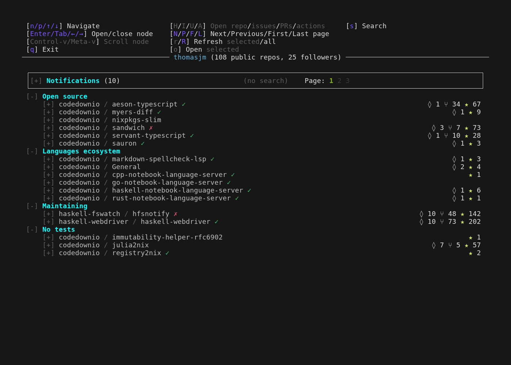
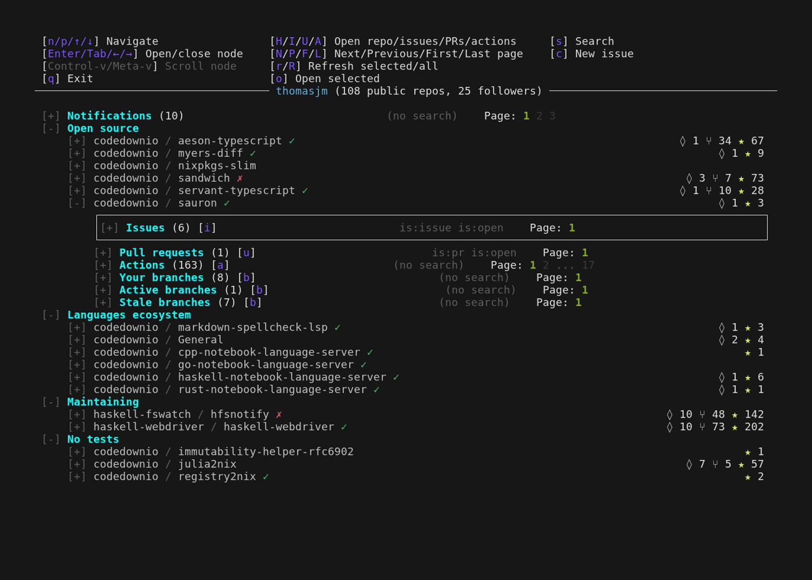
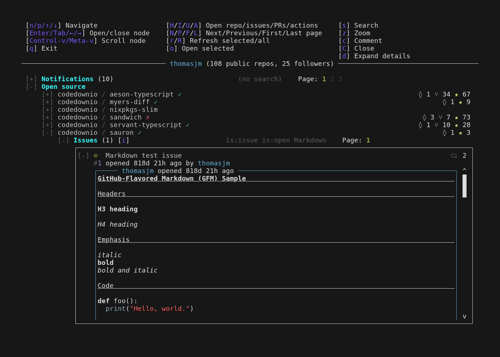
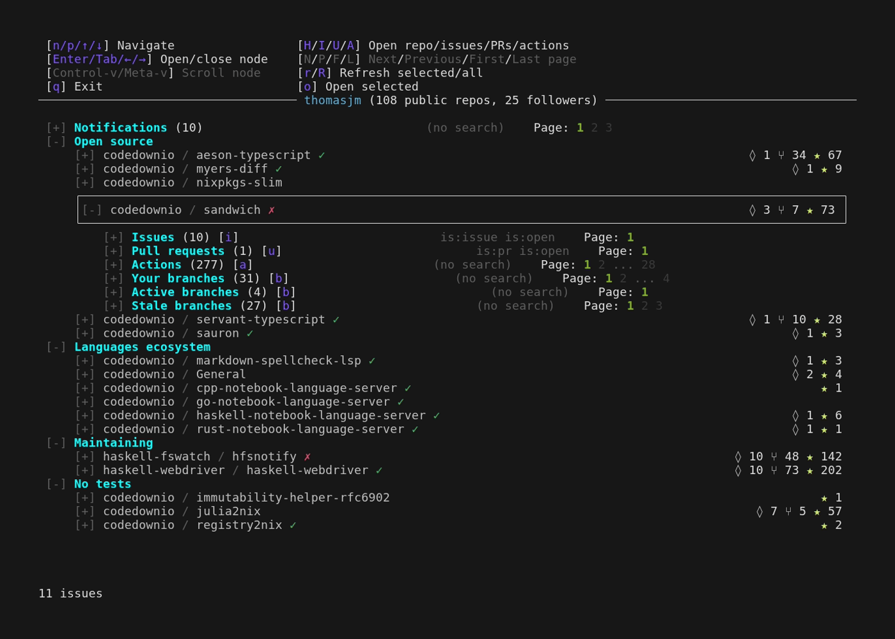
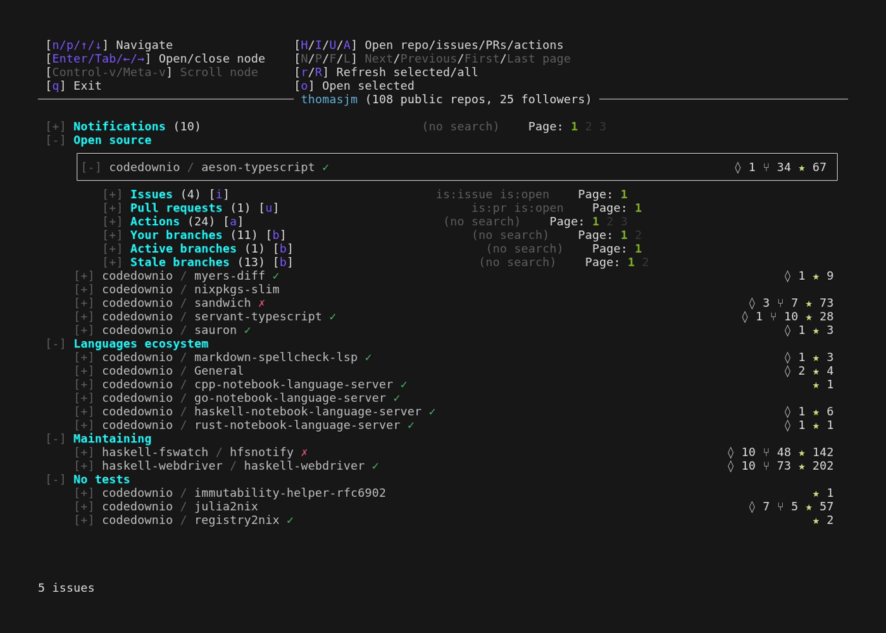

# Demo GIF Plan

A plan for a series of short, targeted GIFs — one per major feature — to embed
throughout `README.md`, replacing the single monolithic `demo.gif`.

## Goals

- **Targeted**: each GIF demos exactly one feature and is short (~8–20s).
- **Continuous**: the GIFs form one logical walkthrough. Each picks up roughly
  where the previous one ended, so a reader scrolling the README feels like
  they're watching one coherent session, chapter by chapter.
- **README-embedded**: each GIF lives in its own section near the prose that
  describes the feature, instead of one giant GIF up top.

The existing `demo_*.gif` / `demo_*.tape` files were a first rough cut at this
breakdown. They're **not** considered good and can be disregarded or cannibalized
for raw material (timings, action sequences). `demo.tape` is the original
all-in-one tape and is the best source of working action sequences.

---

## Tooling & shared conventions

All GIFs are recorded with [VHS](https://github.com/charmbracelet/vhs)
(`.tape` files). Everything lives in the **`gifs/`** folder; render from inside
it (see [Rendering](#rendering) for the exact command).

### Strategy: independent tapes, shortest-path preludes, parallel render

VHS **cannot** segment one run into multiple GIFs. Multiple `Output` lines write
the *same* recording to each path/format; there are no segment markers. And
`Hide` only suppresses *encoding* — VHS still executes every command and `Sleep`
in a hidden block, so a long replayed prelude still costs real render time.

So we don't replay the whole walkthrough. Instead:

1. **Shared header via `Source`.** A `header.tape` holds the common settings; each
   tape starts with `Source header.tape` (native VHS include — no shell scripts).
2. **Shortest-path prelude per chapter.** Each tape navigates *directly* to its
   own start state under `Hide` — the cheapest path from launch, not a replay of
   earlier chapters. (E.g. the comment chapter just searches `markdown` and opens
   the issue; it does not re-do chapter 1's repo browsing.)
3. **Continuity is a visual handoff, not shared state.** Author each chapter so
   its final frame matches the next chapter's opening frame (same repo expanded,
   cursor in the same place). The reader perceives one session; the tapes stay
   independent.
4. **Render in parallel.** Tapes are independent, so total wall-clock ≈ the
   *slowest single tape*, not the sum (run from inside `gifs/`):
   ```
   ls demo_*.tape | xargs -P8 -n1 -I{} \
     direnv exec .. env -u LD_LIBRARY_PATH vhs {}
   ```

`header.tape` (Source'd by every tape):

```
Set FontSize 18
Set Width 1400
Set Height 1000
# Set Theme "<chosen-theme>"   # pick one for consistency across all GIFs
```

Each tape then sets its own `Output` and launch:

```
Source header.tape
Output demo_<name>.gif

Hide
Type@1ms "sauron -c $HOME/tools/sauron/demo_config.yaml"
Enter
Sleep 2s
... shortest path to this chapter's start state (fast) ...
Show
... this chapter's human-paced actions ...
```

Keep the unavoidable cost in mind: the prelude must still wait for the real
GitHub fetches it navigates into (issues, logs, comments). Trim every *other*
sleep in the hidden section to the minimum.

### Polish notes

- Consider `Set Theme` for a consistent, attractive palette across all GIFs
  (the current tapes inherit the terminal default). Pick one and reuse it.
- Keep human-paced navigation at `@200ms` for scrolling (as in current tapes) so
  motion is followable; type comments at default speed so they read naturally.
- Optimize output size with `gifsicle -O3 --lossy=40` — the current overview GIF
  is ~2.4 MB; targeted GIFs should land well under 1 MB each.
- End each GIF with a short `Sleep` (~1.5s) on a clean final frame so the loop
  doesn't feel abrupt.

### Demo data reference (`demo_config.yaml`)

Tree on launch (headings are `open: true`):

1. **Notifications** (top-level node)
2. **Open source** — `aeson-typescript`, `myers-diff`, `nixpkgs-slim`,
   `sandwich`, `servant-typescript`, `sauron`
3. **Languages ecosystem** — `markdown-spellcheck-lsp`, `General`,
   `cpp-notebook-language-server`, `go-…`, `haskell-…`, `rust-…`
4. **Maintaining** — `hfsnotify`, `haskell-webdriver`
5. **No tests** — `immutability-helper-rfc6902`, `julia2nix`, `registry2nix`

Repo navigation from launch (cursor starts on Notifications): `aeson-typescript`
is `Down 2`; `codedownio/sauron` is `Down 7`. Inside an expanded repo: Issues =
`Down 1`, Pull requests = 2, Actions = 3, Your branches = 4.

- **`codedownio/sauron`** is the issues/comment repo (chapters 2–3) — dogfooding.
  Issue **#1 "Markdown test issue"** has a rich GFM body (headers, code, tables,
  task lists) and existing comments; **#19** is an "Open/close test issue".
  Commenting here is safe (own test issues).
- **`aeson-typescript`** is used for workflows (chapter 4) and branches
  (chapter 5) — it has a big CI matrix and many branches with ahead/behind. Using
  a different repo here also reinforces the multi-repo story.

---

## The walkthrough (chaptered)

Six chained chapters form the main narrative. Handoff state is called out so each
chapter's prelude is unambiguous.

### 1. Repo viewing → `demo_overview.gif`
**README section:** hero / **Multi-repo dashboard**

- **Start:** fresh launch, cursor at top (Notifications selected).
- **Beats:**
  - Brief pause to let the layout register (sections, repo rows with health
    check icons, watch/fork/star counts).
  - Scroll down through repos with `Down@200ms` across the "Open source" and
    "Languages ecosystem" headings — show the multi-repo, multi-section view and
    the per-repo health indicators.
  - Open a repo (`Tab`) → reveals its Issues / PRs / Workflows / Branches
    subsections. Pause.
  - Collapse it (`Left`).
  - Scroll down to `codedownio/sauron`, open it (`Tab`), then move cursor down
    onto its **Issues** subsection.
- **End / handoff:** `codedownio/sauron` expanded, cursor parked on its **Issues**
  subsection (collapsed).
- **Length:** ~13s.

### 2. Issue browsing → `demo_issues.gif`
**README section:** **Issues & pull requests**

- **Prelude (hidden):** launch → `Down 7` to `codedownio/sauron` → `Tab` to
  expand → `Down 1` onto its Issues subsection. (Matches chapter 1's final frame.)
- **Start (visible):** on `codedownio/sauron` → Issues.
- **Beats:**
  - `Tab` to expand the issues list. Scroll through the open issues with `Down`.
  - Press `s` → `Ctrl+e` → type ` Markdown` → `Enter`. This **appends** the term
    to the pre-filled GitHub qualifiers (`is:issue is:open`), narrowing to 1 and
    showing off qualifier-syntax support.
  - `Down`, `Tab` to open the matched issue (#1 "Markdown test issue"); scroll
    through the rendered GFM body (headers, code, tables, task lists) with `Ctrl+v`.
- **End / handoff:** issue #1 open and scrolled into its body.
- **Length:** ~16s.
- **Search gotcha (learned while building):** pressing `s` opens the search box
  **pre-filled** with the current query. Typing immediately corrupts it (you get
  `is:openMarkdown` → 0 results). Either `Ctrl+e` then append (keeps the open
  filter, narrows down — what we do) or `Ctrl+a`/`Ctrl+k` to clear first (drops
  the filter, so a plain word can *increase* the count by pulling in PRs/closed).

### 3. Issue commenting → `demo_comment.gif`
**README section:** **Comment on issues & PRs**

- **Prelude (hidden):** launch → open `codedownio/sauron` → Issues → `s` + append
  ` Markdown` → open issue #1. Matches chapter 2's final frame.
- **Start (visible):** issue #1 open.
- **Beats:**
  - Press `z` to zoom the issue into the full-screen detail view; scroll it.
  - `Ctrl+End` to jump to the bottom of the discussion.
  - Press `c` to enter comment mode → a split **Write / Preview** composer.
  - Type a comment with a fenced code block; the Preview pane renders it with
    syntax highlighting live.
  - `Alt+Enter` to submit; pause to show it post. `Ctrl+q` to close the zoom.
- **End / handoff:** back in the issues list.
- **Length:** ~20s.
- **⚠ This tape POSTS A REAL COMMENT** to `codedownio/sauron#1` (a test issue)
  every time it renders. Submit is **`Alt+Enter`** (= `KEnter [MMeta]` in the
  source); the composer's on-screen "`Ctrl+Enter`" label is wrong and does
  nothing in a terminal. Delete the test comment afterward if you re-render.

### 4. Workflow browsing → `demo_workflows.gif`
**README section:** **Workflow runs & job logs**

- **Prelude (hidden):** launch → open `aeson-typescript` → cursor on its
  Workflows/Actions subsection (jump key `a`, or `Down` to it).
- **Start (visible):** on `aeson-typescript` → Workflows.
- **Beats:**
  - Navigate to the **Actions/Workflows** subsection (jump key `a`, or collapse
    up and scroll down).
  - `Tab` to expand → workflow runs list (show the run status icons / spinners).
  - Open the first run (`Tab`) → jobs load (brief fetch spinner). Optionally
    press `X` to sort jobs by failures, to show the sort feature.
  - Open a job (`Tab`) → open a log group (`Tab`) → show **syntax-highlighted /
    ANSI-colored** log lines.
  - Press `z` to zoom the logs full-screen.
- **End / handoff:** logs zoomed (or collapse back to the repo's Branches
  subsection for chapter 5).
- **Length:** ~18s.
- **Reuse:** `demo_workflows.tape` is the base; add the `X` sort beat and a
  slightly longer pause on the colored logs.

### 5. Branches → `demo_branches.gif`  *(new — "impressive" extra)*
**README section:** **Branches**

- **Prelude (hidden):** launch → open `aeson-typescript` → cursor on its
  **Branches** subsection (jump key `b`).
- **Start (visible):** on `aeson-typescript` → Branches.
- **Beats:**
  - Expand Branches → show the variants (All / Yours / Active / Stale).
  - Open **Your Branches** or **Active Branches** to reveal the rich columns:
    `↑ ahead ↓ behind` (green/orange arrows), check status (`✓ Checks` /
    `✗ Failed` / `● Running`), last-commit time, and PR info (`PR #42`, merged,
    closed, or none).
  - Slowly scroll so the colored ahead/behind + check columns are legible.
- **End / handoff:** branches visible; collapse back up toward the top for
  chapter 6.
- **Length:** ~12s.
- **Why:** ahead/behind with colored arrows + per-branch CI status is a genuine
  differentiator vs. `gh`/`gh-dash` and is visually striking.

### 6. Notifications → `demo_notifications.gif`
**README section:** **Notifications**

- **Prelude (hidden):** launch → cursor on the **Notifications** node at the top
  (it's the first node, so this is nearly free).
- **Start (visible):** on the **Notifications** node.
- **Beats:**
  - `Tab` to expand notifications; scroll through a few (show unread `●` dots and
    read/done icons).
  - Open a notification (`Tab`) → it fetches the issue/PR and **auto-scrolls to
    and highlights the latest comment** (yellow highlight) — the headline feature.
- **End:** holding on the opened notification with the highlighted latest comment.
- **Length:** ~14s.
- **Why:** the auto-jump-to-latest-comment is one of the strongest "you can't do
  this in `gh`" moments.
- **Gotchas (learned while building):**
  - The demo's top notification is a third-party (nixpkgs) thread, so we do NOT
    `c`-reply (would post to someone else's repo) and do NOT press `D` (mutates
    your real notifications). Both were dropped from the original beat list.
  - On a notification, `c` opens nothing useful and a following `Ctrl+q` falls
    through to **quit the app** — avoid that sequence here.
  - The thread needs ~7s to fetch before the highlighted comment appears.

---

## Bonus / standalone GIFs (separate launches)

These need a different launch or stand better on their own, so they don't chain
into the main walkthrough. Optional, in priority order.

### A. Split-logs view → `demo_split.gif`  *(strong differentiator)*
**README section:** **Split view (`--split-logs`)** / CLI options

Requires a different launch: `sauron --split-logs -c …`. Show the 50/50 layout,
`Ctrl+Right` to focus the log pane, `d`/`i`/`w`/`e` to filter log levels, live
logs updating while navigating the left pane. ~12s.

### B. Create an issue → `demo_new_issue.gif`
**README section:** **Issues & pull requests** (or its own "Create issues" note)

On an Issues subsection press `c` (create-new, not comment) → type a title,
`Tab` to body, type a body, `Alt+Enter` to submit → show it appear at the top of
the list. Could be chained after chapter 2 instead if you prefer. ~12s.

### C. Pagination & search → `demo_pagination.gif`
**README section:** **Issues & pull requests**

In a large paginated section, show `N`/`P`/`F`/`L` moving through pages with the
`1 2 … [12] 13 … 99` page indicator updating. Pairs naturally with search.
Lower priority — somewhat covered by chapter 2. ~10s.

---

## Proposed README layout

Replace the single hero `demo.gif` with the overview GIF, then give each feature
bullet its own subsection with the matching GIF:

```
# sauron
<overview blurb>

        ← chapter 1, hero

## Features

### Issues & pull requests
<prose>
            ← chapter 2
          ← chapter 3

### Workflow runs & job logs
<prose>
      ← chapter 4

### Branches
<prose>
        ← chapter 5

### Notifications
<prose>
 ← chapter 6

### Split view
<prose>
              ← bonus A
```

---

## Production checklist

- [x] 0. `header.tape` — shared settings, `Source`'d by every tape
- [x] 1. `demo_overview.gif` — repo viewing; ends on aeson-typescript → Issues
- [x] 2. `demo_issues.gif` — issue browsing + `NonEmpty` search; ends on #60 open
- [x] 3. `demo_comment.gif` — zoom + comment (posts a real comment — see warning)
- [x] 4. `demo_workflows.gif` — run → job → log group → zoom (with `X` sort)
- [x] 5. `demo_branches.gif` — ahead/behind + checks + PR info (new)
- [x] 6. `demo_notifications.gif` — auto-jump to latest comment (new)
- [ ] A. `demo_split.gif` — split-logs view (new, separate launch)
- [ ] B. `demo_new_issue.gif` — create issue (optional)
- [ ] C. `demo_pagination.gif` — pagination (optional)
- [ ] Pick & apply a shared `Set Theme` (in `header.tape`)
- [x] Verify each chapter's final frame ≈ next chapter's opening frame
- [ ] Re-check handoffs once a `Set Theme` is chosen (re-render)
- [ ] Optimize all GIFs with `gifsicle` (current sizes 0.6–1.5 MB each)
- [ ] Restructure README into per-feature sections; remove old `demo.gif` / `demo.tape`

## Rendering

All tapes and gifs live in the **`gifs/`** folder (`header.tape`,
`pause_*.tape`, `demo_*.tape`, `demo_*.gif`). Render **from inside `gifs/`** so
the relative `Output` and `Source` paths resolve there.

Use the repo's **direnv** `vhs` — it's `pkgs.vhs` patched with
`nix/vhs-add-home-end-keys.patch`, which is what makes `Ctrl+End` / `Home` /
`End` work in the tapes (stock vhs ignores them).

```
cd gifs
direnv exec .. env -u LD_LIBRARY_PATH vhs demo_overview.tape
# or all of them:
for t in demo_*.tape; do direnv exec .. env -u LD_LIBRARY_PATH vhs "$t"; done
```

(`direnv exec ..` loads the repo-root devShell env while the cwd stays in
`gifs/`.)

**Why `-u LD_LIBRARY_PATH`:** the ambient `LD_LIBRARY_PATH` (alsa-lib) drags a
second glibc into vhs's bundled `ffmpeg`, which then dies with
`GLIBC_ABI_DT_X86_64_PLT not found`. Unsetting it for the vhs process fixes it.

(VHS also rejects absolute `Output`/`Screenshot` paths — keep them relative and
run from inside `gifs/` so `Source header.tape` / `pause_*.tape` resolve.)
